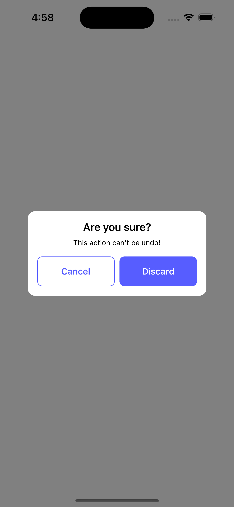
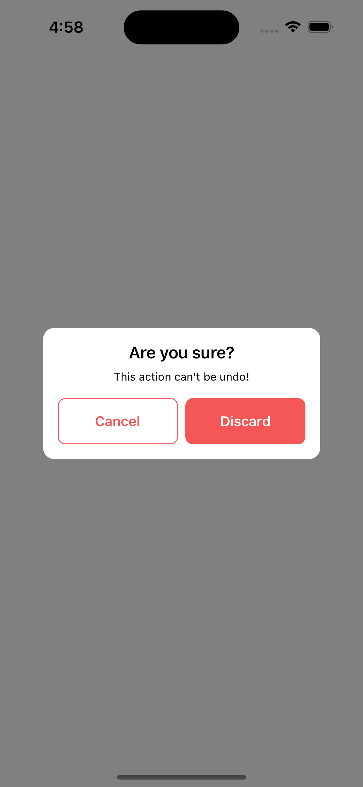

# NWAlert

A alert write by swift  

# Images
<div align = "center">


</div>

# Requirements

- Swift : 5+ 
- Xcode 14+
- iOS 13+


# Installation 

** SPM

```
dependencies: [
    .package(url: "https://github.com/volythat/NWAlert.git", .upToNextMajor(from: "1.0.0"))
]
```  

# Use 

```swift 
    let alert = NWAlertController(title: "Are you sure?",
                                  message: "This action can't be undo!",
                                  buttons: [NWAlertButton("Cancel",style: .destructive),
                                            NWAlertButton("Discard",style: .destructive,highlight: true)])
    alert.options = NWAlertOptions()
    alert.alertButtonAction = { action in
        print("action = \(action.title)")
    }
    self.present(alert , animated: true)

```


# Author : volythat

